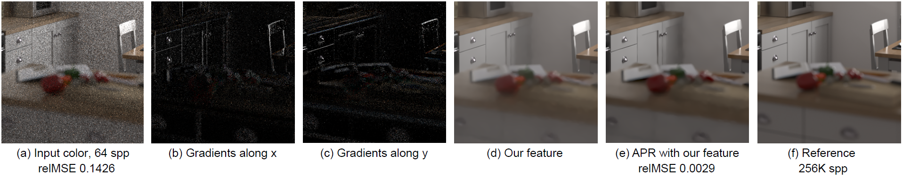

# [Feature Generation for Adaptive Gradient-Domain Path Tracing](https://cglab.gist.ac.kr/publications/2018_Feature_Generation_for_Adaptive_Gradient-Domain_Path_Tracing.html)

[Jonghee Back](https://cglab.gist.ac.kr/people.html), [Sung-Eui Yoon](https://sglab.kaist.ac.kr/~sungeui/), [Bochang Moon](https://cglab.gist.ac.kr/people/bochang.html)



## Overview

Feature generation is an integrated solution between feature-based reconstruction and gradient domain rendering framework.
It is easy to use new feature as the input of feature-based denoising methods with other features in gradient-domain rendeinrg.
Please check our [project page](https://cglab.gist.ac.kr/publications/2018_Feature_Generation_for_Adaptive_Gradient-Domain_Path_Tracing.html) in detail.

Our algorithm consists of two parts.

- Feature generation dependencies
- Main feature generation project

The objective of the first one is to obtain sample buffers for a bagging process in gradient-domain rendering.
It should be noted that L1 or L2 reconstruction is not performed and only new feature is generated in GPT.
The code was implemented on top of GPT.
If you are interested in gradient-domain path tracing framework, please refer to the [project page](https://mediatech.aalto.fi/publications/graphics/GPT/).

Second is a standalone version of feature generation project.
Feature generation is implemented using Visual Studio 2013 and CUDA 9.0 in Windows 10.
Linux and Mac OS are not supported yet. If you have any questions or comments, feel free to contact us.

**Jonghee Back, GIST (jongheeback@gist.ac.kr)**

**Bochang Moon, GIST (bmoon@gist.ac.kr)**


## Usage

### Building

Gradient-domain rendering framework must be prepared first.

1. Prepare gradient-domain path tracing framework (Refer to GPT project page)
2. Build FeatureGenerator project and copy 'FeatureGeneration.lib' and 'cudart_static.lib' to dependencies folder of GPT
    - Copy into "(GPT_PATH)/dependencies/lib/x64_vc12"
    - 'cudart_static.lib' is located on "$(CUDA_PATH)/lib/x64"
3. Copy feature source code in FeatureGenerator project (five code files) into dependencies folder of GPT
    - Copy into "(GPT_PATH)/dependencies/include/FeatureGenerator"
4. Unzip feature_generation_dependencies.zip and overwrite it into GPT framework   
5. Build gradient-domain path tracing

### Scene

Please add the following information to xml file of scene in order to run the feature generation.


```
<integrator type="gpt">
  /* --------------------- */
  /*  Original parameters  */
  /* --------------------- */
  <boolean name="reconstructL1" value="false"/>
  <boolean name="reconstructL2" value="false"/>
  <boolean name="reconstructFeature" value="true"/>
<integrator/>
```

## License

All source code files in Feature_generation_dependencies_GPT.zip are released under the GNU GPLv3.
A software list that we use is as follows.

  - Mitsuba 0.5.0 released by Wenzel Jakob under the terms of the GNU GPLv3

Separately, the feature generation project is under a BSD License.
Please refer to [our license file](https://github.com/CGLab-GIST/feature-generation/blob/master/license.txt).

## Citation

If you use our code and paper, please check as below.


```
@article{
  author = {Back, Jonghee and Yoon, Sung-Eui and Moon, Bochang},
  title = {Feature Generation for Adaptive Gradient-Domain Path Tracing},
  journal = {Computer Graphics Forum},
  volume = {TBA},
  number = {TBA},
  pages = {TBA},
  year = {2018}
}
```

## Release Notes

### v1.0

Initial version of feature generation.


